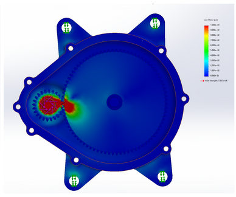
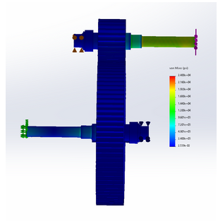

# ENGR380 Gearbox Design Project

Single-stage speed reduction gearbox designed for vessel propulsion, developed as part of Design of Machine Elements at UBC.

## ⚙️ Project Overview

Our project involves the design of a one-stage gearbox that reduces input speed from **1750 RPM to 500 RPM**, transmitting **25 horsepower** with a design life of **20,000 hours**.

### Key Specifications

- Input Speed: 1750 RPM  
- Output Speed: 500 RPM  
- Power: 25 HP  
- Gear Ratio: 3.5  
- Center Distance ≤ 11 inches  
- Pressure Angle: 20°  
- Life Cycle: 20,000 hours  
- Safety Factors:  
  - Surface fatigue ≥ 1.2 (pinion) / 1.5 (gear)  
  - Bending fatigue ≥ 1.2 (both)  

## 🛠️ Design Highlights

- **Gears**:  
  - Spur gear selection (24 teeth pinion, 84 teeth gear)  
  - Material: AISI 1045 Steel  
  - Diametral Pitch: 8 in⁻¹  
  - Optimized for durability, manufacturability, and cost

- **Shafts**:  
  - Material: AISI 1045 Cold Drawn Steel  
  - Diameter: 1.25 in (standardized for pinion & gear shafts)  
  - Safety Factor (Goodman): >2.5  

- **Bearings**:  
  - Selected: 4× 6205 Ball Bearings (McMaster-Carr)  
  - Rated Load: ≥ 3100 lbs  
  - L10 life of 20,000 hours, 95% reliability  

- **Keys**:  
  - Standard square keys (0.25 in width, 3/16 in height)  
  - Oversized relative to loads = non-critical

- **Housing**:  
  - Custom-designed in Solidworks  
  - Grease fill/drain ports, water-resistant gasket, 4 mounting points  
  - Topology-optimized for 30% mass reduction

## 📊 Analysis & Simulation

- FEA (Solidworks) to validate component stresses and housing design  
- Simulation insights informed design reinforcements and mass optimization

  
  

<em>Image 1 and 2. FEA analysis on shaft and gear at max load</em>

## 🖥️ Resources

- 📊 [Design Calculation Spreadsheet (Google Sheets)](https://docs.google.com/spreadsheets/d/1tdEeqloJ8dzuTQ6yWyKJt5SsLno6nZbMs4ButX7PKK4/edit?usp=sharing)  
- 🖼️ Solidworks Drawings: See `/drawings/` folder in repository

## 👥 Team

- Muhammad Siraaj Khan Girdhurparsadh  
- Yan Zhang  
- Phuwa Triprasitsak  
- Zachrey Zhu  
- Joshua Zhu  

